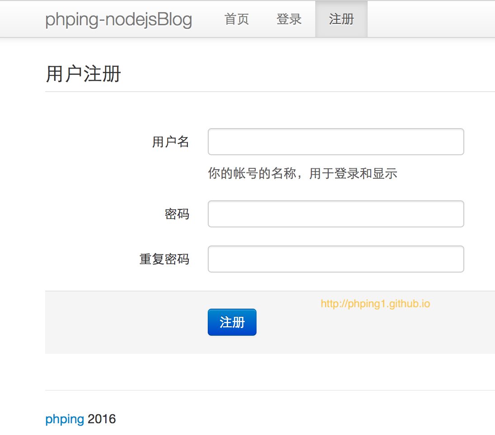
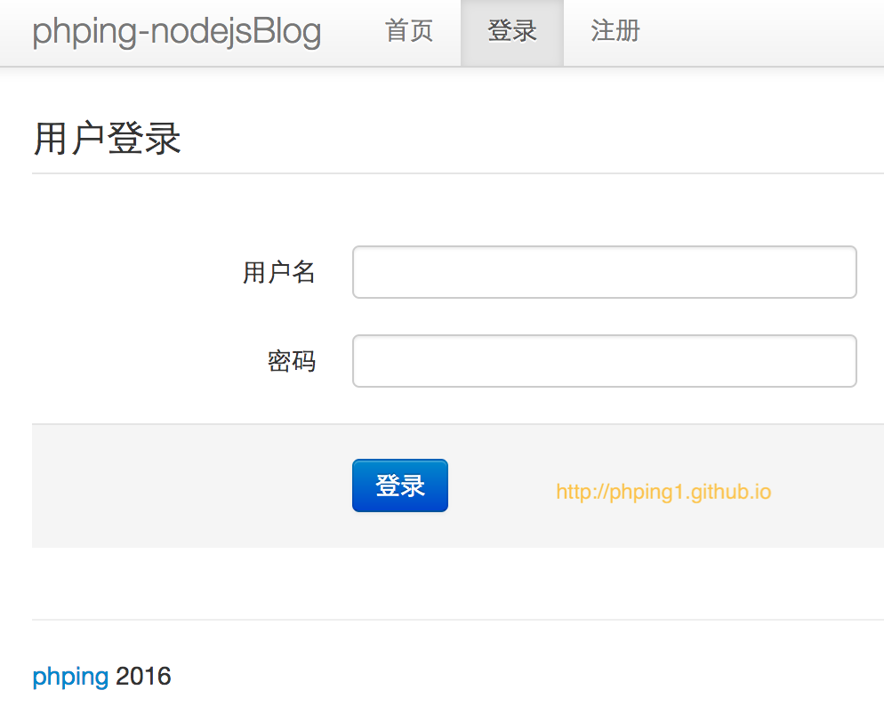
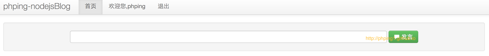
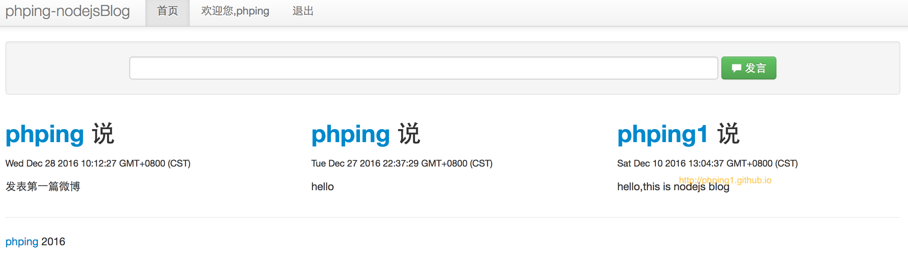
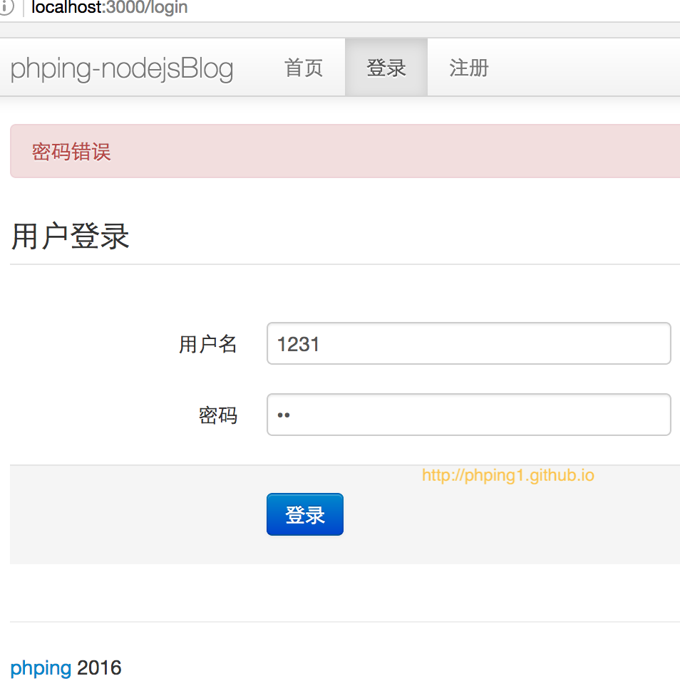
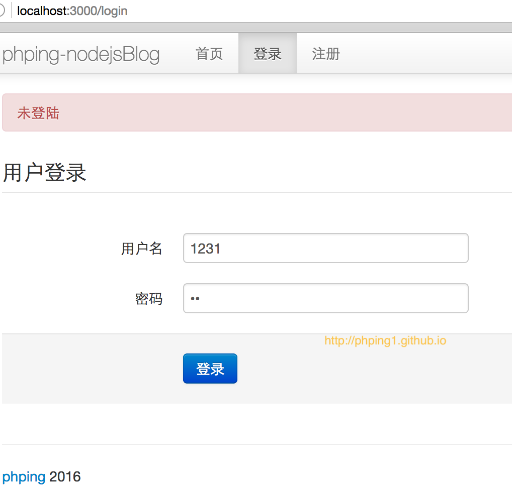

### 前言
> 1. 参考Nodejs开发指南一书的第5章，受限于书中的nodejs和express版本太低，相当一部分代码在新版本的nodejs和express下都是无法使用
> 2. 感谢[cnodejs社区]
> 3. 目前完成了一个简单微博所应具有的基础功能，后续会对此项目进行优化，完善和补充

## 微信公众号
欢迎关注微信公众号：

可以访问 [这里](https://mp.weixin.qq.com/mp/appmsgalbum?action=getalbum&album_id=1410124501450571776&__biz=MzAwMjk5NTY3Mw==#wechat_redirect) 查看更多关于**大数据平台建设**的原创文章。

### 开发环境
1. 操作系统: OSX Yosemite 10.10.5
2. `nodejs` : v5.1.0QrCode.jpeg
3. `express` : 4.14.0
4. `MongoDB` : 3.2.7

### 项目介绍
#### 1.用户注册
界面如下：

#### 2.用户登录

#### 3.发表微博

#### 4.显示微博

#### 5.登录密码错误
在注册成功后，尝试登录时，如果密码错误，则提示:

#### 6.权限控制
比如，在未登录的情况下，
- 访问 /logout时，会提示:

用户已经登陆过时：
- 手动输入 /login后，不让render 登录页面，且提示已经登录
- 手动输入 /reg 后，不让render 注册页面，且提示已经登录

#### 7.优化路由
通过express.router和写公共中间件来优化路由
#### 8.优化errHander
当在测试环境下出现错误的路由时，会出现智能提示，显示错误信息

#### 9.其它功能
